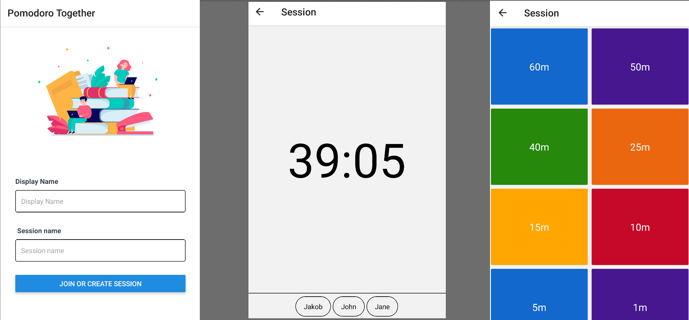

# Pomodoro Together

A social pomodoro app for productivity. Create Pomodoro sessions which friends
can join to use as a synchronized work timer.

This is a WIP app, I will continue to develop this app when I have the
time/motivation. It's currently an MVP with most functionality implemented, but
not very styled or customizable.

### Features

* Realtime synchronized pomodoro timer for groups.
* Create, pause, increment timers, with both work and break mode.
* Minimalist interface focused on efficiency

### Tech stack

This app uses

* React Native
* Tailwind CSS
* Socket IO (For backend communication)

For the backend stack, see [here](https://github.com/jakobkhansen/PomodoroTogetherBackend)
